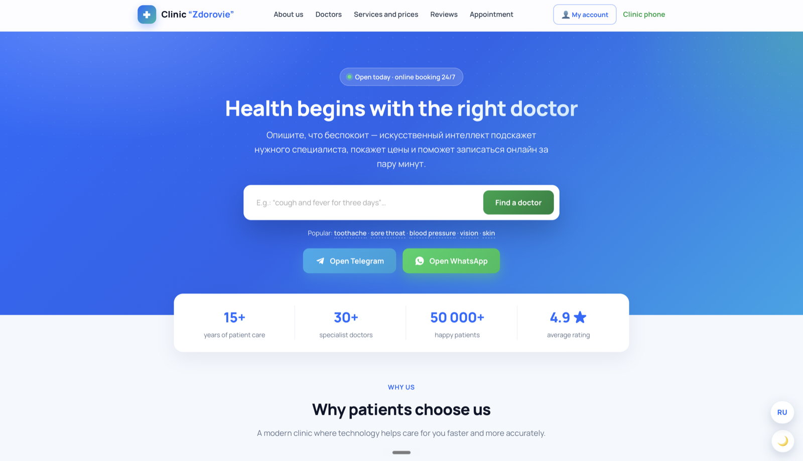
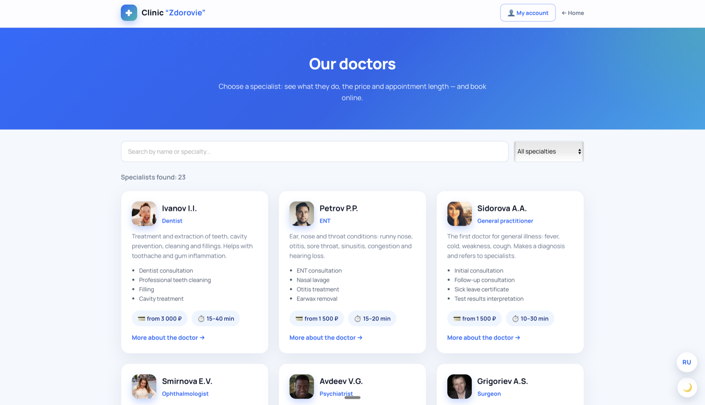
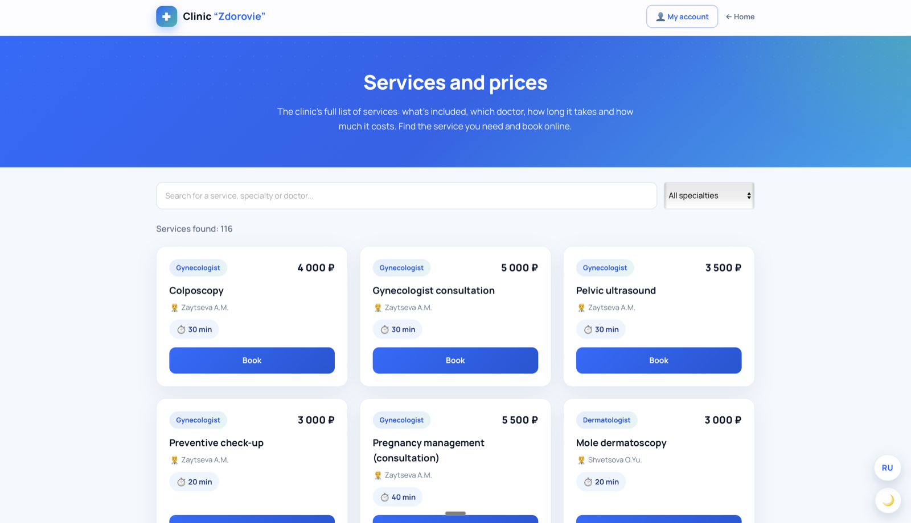
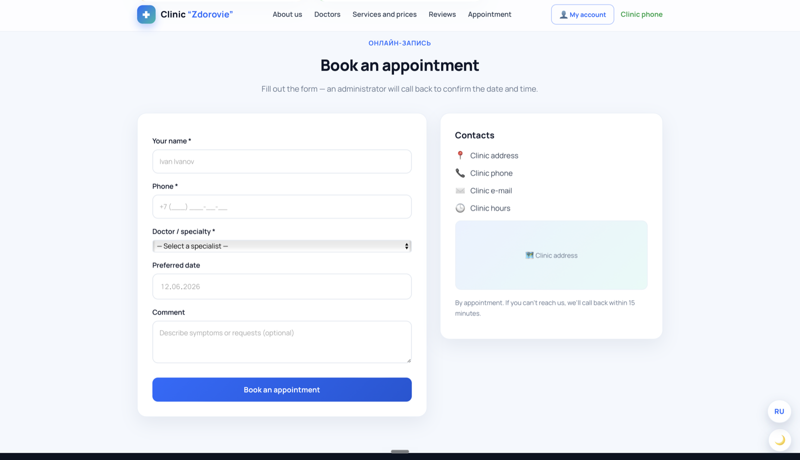

# Zdorovie Medical Center — Portfolio Case Study

A modern, bilingual website for a medical clinic with **AI symptom-to-doctor matching**,
online appointment booking, role-based dashboards (patient / doctor / admin) and a
Telegram bot — built with plain HTML/CSS/JS on top of Supabase.

🔗 **Live demo:** https://vlad23snk-del.github.io/med-clinic/
💻 **Source code:** https://github.com/vlad23snk-del/med-clinic
📄 **License:** MIT

---

## One-line summary

> An open-source clinic platform that turns “I don't know which doctor I need” into a
> booked appointment in two minutes — with full RU/EN localization down to the database content.

---

## The problem

Patients often don't know which specialist to see, clinic phone lines are busy, and small
clinics rarely have the budget for an expensive booking system. The goal was a lightweight,
fast, fully self-hostable site that:

- helps a patient pick the right specialist from a plain-language description of symptoms,
- lets them book online 24/7 (web or Telegram),
- gives the clinic simple tools to manage doctors, services and appointments.

---

## What it does

| Area | Highlights |
|------|------------|
| **AI doctor matching** | Patient types symptoms in natural language → the system suggests the right specialty and urgency. |
| **Booking** | On-site booking form + booking through a Telegram bot; admin call-back confirmation. |
| **Catalogs** | 20+ doctors and 100+ services with prices, durations and specialties, with live search & filtering. |
| **Dashboards** | Separate logins and views for patients, doctors and clinic administrators. |
| **Patient card** | Patients fill medical history in advance; doctors create cards and attach files. |
| **Notifications** | Telegram confirmations and reminders a day and an hour before the visit. |
| **Voice confirmation** | Automated phone-call confirmation of bookings. |
| **Localization** | Full RU/EN switch — including DB-driven content (doctor names, specialties, descriptions, services, prices, durations). |
| **UX** | Light/dark theme, responsive layout, SEO meta tags, accessible markup. |

---

## Architecture

```
Browser (static HTML/CSS/JS, no framework)
        │  supabase-js
        ▼
Supabase
 ├── PostgreSQL  (doctors, services, patients, appointments, …) + Row Level Security
 └── Edge Functions (Deno/TypeScript)
       ├── symptom-search   → AI symptom-to-specialist matching
       ├── patient-api / doctor-api / admin-api  → role-scoped data access
       ├── telegram-bot / telegram-notify        → booking & reminders
       └── voice-confirm    → automated call confirmation
```

**Why this stack:** zero build step, instant load, free static hosting (GitHub Pages / Vercel),
and a serverless backend that scales to zero. The public `anon` key is safe in the client
because all access is gated by Row Level Security policies.

---

## Engineering highlights

- **Custom i18n engine (no dependencies).** A DOM-walking translator with a hand-built
  dictionary that also retranslates **dynamically rendered** content via a `MutationObserver`,
  plus fragment rules for number-bearing strings (counters, prices, durations) so even
  database content (e.g. *“Dentist · from 3 000 ₽ · 15–40 min”*) renders correctly in English.
- **Serverless, role-scoped API** split into patient/doctor/admin Edge Functions.
- **Telegram-first booking flow** with confirmations and timed reminders.
- **Security-conscious by default:** RLS policies, request throttling, secrets kept out of
  the repo, security headers configured for the static host.

---

## Tech stack

`HTML` · `CSS` · `Vanilla JavaScript` · `Supabase (PostgreSQL + Edge Functions)` ·
`Deno / TypeScript` · `Telegram Bot API` · `GitHub Pages / Vercel`

---

## My role

End-to-end: product design, UI/UX, frontend, database schema, serverless functions,
Telegram bot, localization engine, and deployment.

---

## Screenshots

| | |
|---|---|
|  |  |
|  |  |

---

*Open-source under the MIT license. Feedback and contributions welcome via GitHub Issues.*
