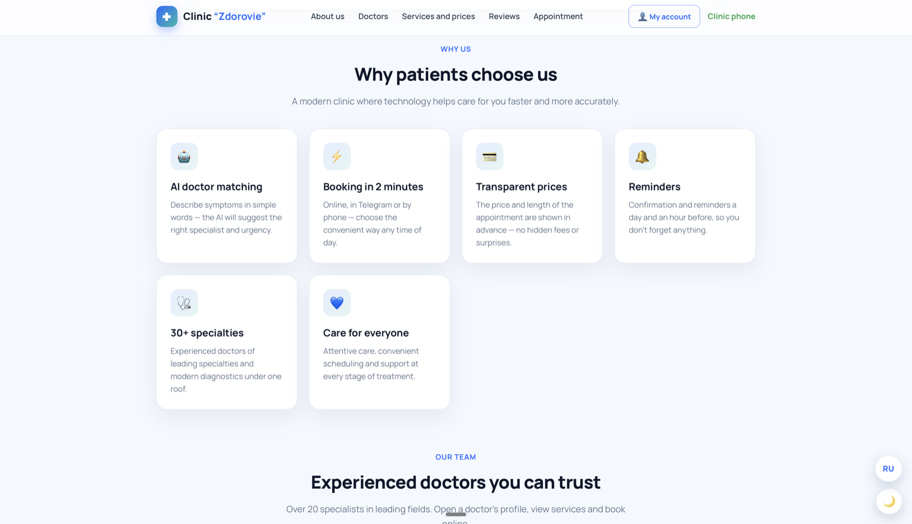
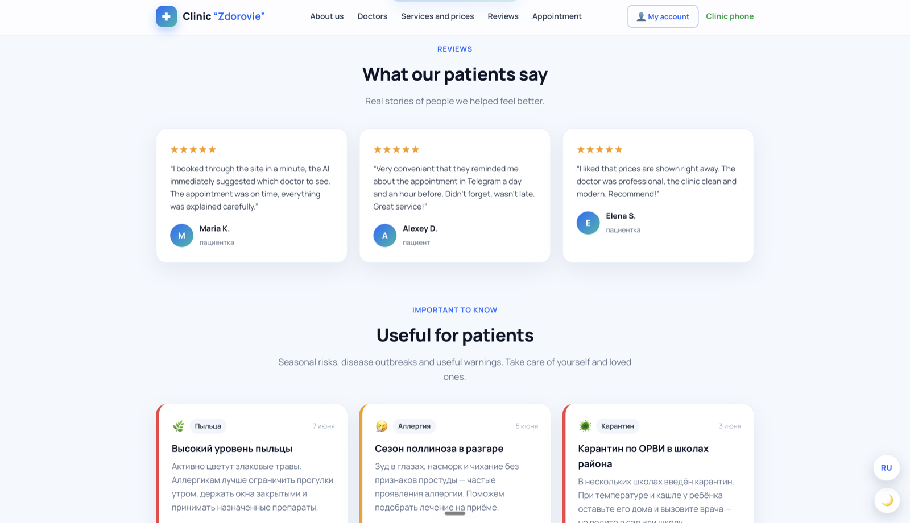
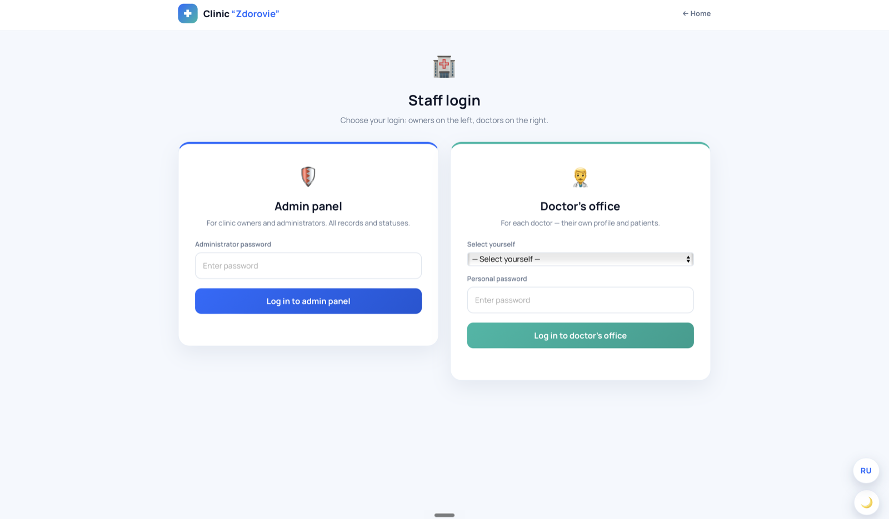

# 🏥 Zdorovie Medical Center

> 🌐 **Language:** **English** · [Русский](README.md)

> A modern medical clinic website with online appointment booking, AI symptom-to-doctor matching, doctor and admin dashboards, and a Telegram bot. Full RU / EN bilingual UI.


🔗 **Live demo (GitHub Pages):** https://vlad23snk-del.github.io/med-clinic/
🔗 **Live demo (Vercel):** _add the link after deploy — see [“Deploy to Vercel”](#-deploy-to-vercel)_

---

## ✨ Features

- 🤖 **AI symptom-to-doctor matching.** The patient describes their complaint in plain language — the system suggests the right specialist.
- 📅 **Online appointment booking.** A booking form on the site plus booking via Telegram.
- 👩‍⚕️ **Doctor and service catalog** with prices, specialties and appointment length.
- 🔐 **Personal dashboards** for the patient, the doctor and the clinic administrator.
- 🗂 **Patient medical card** — the doctor creates a card and attaches files.
- 💬 **Telegram bot** for booking and notifications (RU/EN).
- 📞 **Voice booking confirmation** (via a phone-call service).
- 🌗 **Dark and light themes**, **RU / EN** language switch, fully responsive layout.

> **Full bilingual content.** The language switch translates not only the static UI but also the
> database-driven content — doctor names, specialties, descriptions, service names, prices and durations.

---

## 📸 Screenshots

### Home page — AI symptom-to-doctor search


### Why patients choose us — key features


### Doctor catalog


### Services and prices


### Online appointment booking


### Patient reviews


### Staff login (admin panel and doctor's office)


---

## 🧩 Tech stack

| Layer | What is used |
|-------|--------------|
| Frontend | HTML, CSS, vanilla JavaScript (no frameworks) |
| Database & server | [Supabase](https://supabase.com) (PostgreSQL + Edge Functions on Deno/TypeScript) |
| Bot & notifications | Telegram Bot API |
| Hosting | GitHub Pages / Vercel (static), Supabase (backend) |

---

## 📂 Project structure

```
docs/                     ← the website (this folder is what GitHub Pages / Vercel serves)
├── index.html            Home page (hero, AI search, doctors, services, booking, reviews)
├── doctors.html          Doctor catalog
├── services.html         Services and prices
├── vhod.html             Staff login (admin + doctor)
├── cabinet.html          Patient personal dashboard
├── admin.html            Clinic admin panel
├── doctor.html           Doctor profile
├── vrach.html            Doctor's office (patient card)
├── theme.css / theme.js  Light/dark theme
├── i18n.js               RU/EN language switch (incl. DB content)
├── robots.txt            Search-engine hints
├── vercel.json           Vercel deployment settings
└── screenshots/          Screenshots for the README (en/ = English)

supabase/
├── functions/            Edge Functions
│   ├── symptom-search/    AI symptom search
│   ├── patient-api/       Patient API
│   ├── doctor-api/        Doctor API
│   ├── admin-api/         Administrator API
│   ├── telegram-bot/      Telegram bot
│   ├── telegram-notify/   Telegram notifications
│   └── voice-confirm/     Voice booking confirmation
└── sql/                  Database schemas
```

---

## 🚀 Run it locally

### Option 1. Just open it (fastest)
Download the repository and open `docs/index.html` with a double-click — it opens in the browser.
> ⚠️ Some features (booking, AI search, dashboards) work through Supabase. Opening the file directly shows the full UI, but server functions may not respond due to browser restrictions. For full functionality use Option 2.

### Option 2. Local server (recommended)
From the project folder run:

```bash
cd docs
python3 -m http.server 8000
```

Then open **http://localhost:8000** in your browser.

---

## 🌍 Deploy to Vercel

A free way to publish the site on a nice URL:

1. Sign up at [vercel.com](https://vercel.com) with your **GitHub** account.
2. Click **Add New… → Project** and pick the `med-clinic` repository.
3. In the import settings set **Root Directory** = `docs` (click *Edit* next to the field and choose the `docs` folder).
4. Leave **Framework Preset** as `Other`; don't touch **Build Command** or **Output Directory** — this is a static site, no build needed.
5. Click **Deploy**. In about a minute you'll get a URL like `https://med-clinic-xxxx.vercel.app`.
6. Paste that URL into the “Demo” section at the top of this README.

> `docs/vercel.json` already contains basic security settings — no need to change it.

---

## 🗄 Backend setup (Supabase) — optional

The site talks to a Supabase project. To run your own backend:

1. Create a project at [supabase.com](https://supabase.com).
2. Run the SQL scripts from `supabase/sql/` in the Supabase SQL editor.
3. Deploy the functions from `supabase/functions/` via the [Supabase CLI](https://supabase.com/docs/guides/functions).
4. In `docs/index.html` replace `SUPABASE_URL` and the public `SUPABASE_KEY` with your project's values.

> 🔒 The public (`anon`) Supabase key is safe to keep in the code — data access is restricted by Row Level Security policies. Secret keys and tokens are **not** committed (see `.gitignore`).

---

## 🤝 Feedback

The project is open to feedback and ideas! Found a bug or have a suggestion — open an
[Issue](https://github.com/vlad23snk-del/med-clinic/issues) in this repository.

---

## 📄 License

Released under the **MIT** license — free to use, modify and distribute. See [LICENSE](LICENSE).
