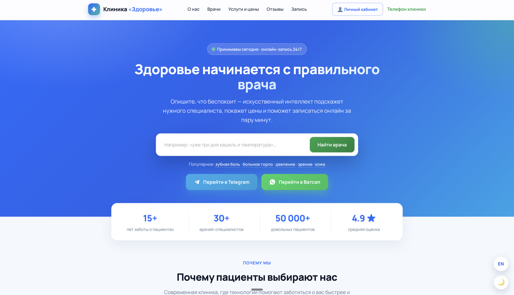
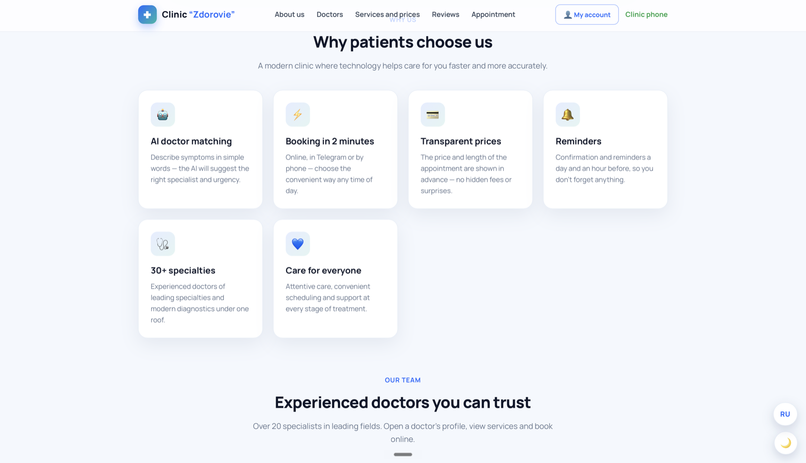
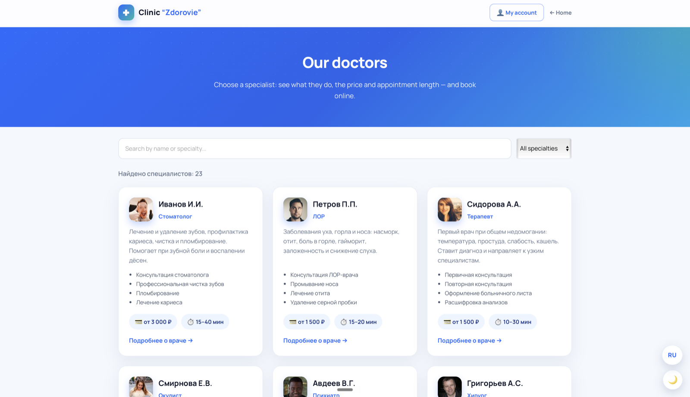
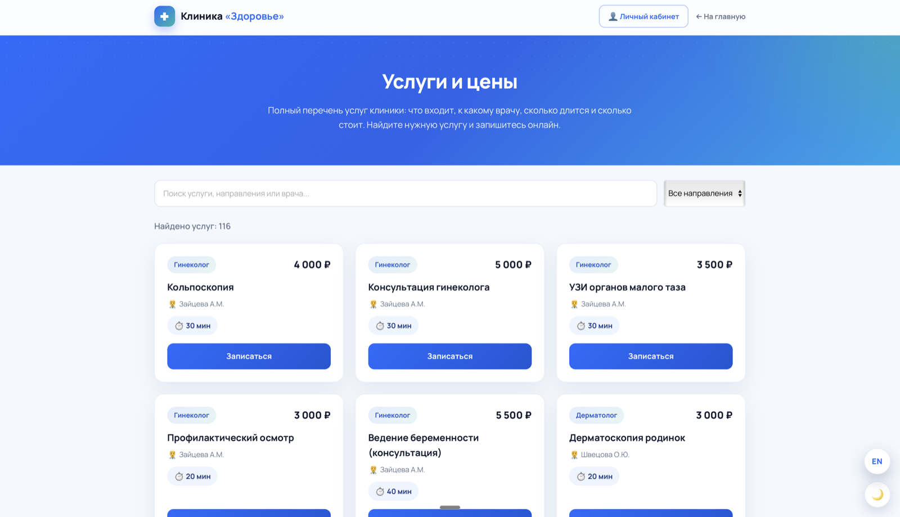
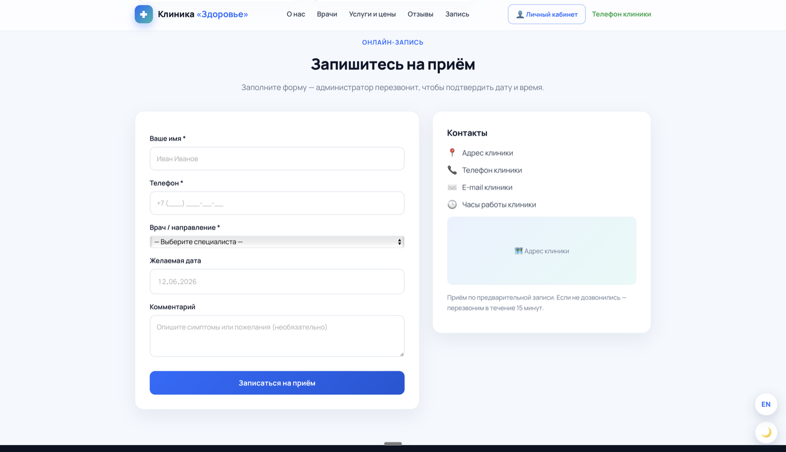
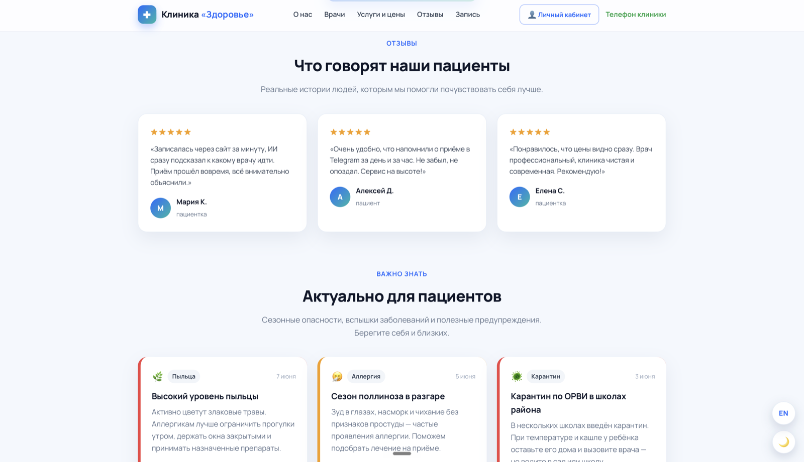
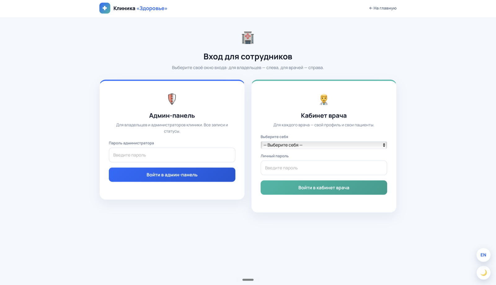

# 🏥 Медицинский центр «Здоровье»

> 🌐 **Язык:** **Русский** · [English](README.en.md)

> Современный сайт медицинской клиники с онлайн-записью к врачу, ИИ-подбором специалиста по симптомам, личными кабинетами врача и администратора и Telegram-ботом.


🔗 **Демо (GitHub Pages):** https://vlad23snk-del.github.io/med-clinic/
🔗 **Демо (Vercel):** _добавьте ссылку после деплоя — см. раздел [«Публикация на Vercel»](#-публикация-на-vercel)_

---

## ✨ Что умеет сайт

- 🤖 **ИИ-подбор врача по симптомам.** Пациент описывает жалобу простыми словами — система подсказывает, к какому специалисту обратиться.
- 📅 **Онлайн-запись на приём.** Форма записи прямо на сайте + запись через Telegram.
- 👩‍⚕️ **Каталог врачей и услуг** с ценами, специальностями и длительностью приёма.
- 🔐 **Личные кабинеты** для пациента, врача и администратора клиники.
- 🗂 **Врачебная карта пациента** — врач создаёт карту и прикрепляет файлы.
- 💬 **Telegram-бот** для записи и уведомлений (RU/EN).
- 📞 **Голосовое подтверждение записи** (через сервис обзвона).
- 🌗 **Тёмная и светлая темы**, переключение языка **RU / EN**, адаптивная вёрстка.

---

## 📸 Скриншоты

### Главная страница — ИИ-поиск врача по симптомам


### Почему выбирают нас — ключевые возможности


### Каталог врачей


### Услуги и цены


### Онлайн-запись на приём


### Отзывы пациентов


### Вход для сотрудников (админ-панель и кабинет врача)


---

## 🧩 Технологии

| Слой | Что используется |
|------|------------------|
| Внешний вид | HTML, CSS, нативный JavaScript (без фреймворков) |
| База данных и сервер | [Supabase](https://supabase.com) (PostgreSQL + Edge Functions на Deno/TypeScript) |
| Бот и уведомления | Telegram Bot API |
| Хостинг | GitHub Pages / Vercel (статика), Supabase (бэкенд) |

---

## 📂 Структура проекта

```
docs/                     ← сайт (именно эту папку публикует GitHub Pages / Vercel)
├── index.html            Главная страница (герой, ИИ-поиск, врачи, услуги, запись, отзывы)
├── doctors.html          Каталог врачей
├── services.html         Услуги и цены
├── vhod.html             Вход для сотрудников (админ + врач)
├── cabinet.html          Личный кабинет пациента
├── admin.html            Админ-панель клиники
├── doctor.html           Профиль врача
├── vrach.html            Кабинет врача (карта пациента)
├── theme.css / theme.js  Светлая/тёмная тема
├── i18n.js               Переключение языка RU/EN
├── robots.txt            Подсказки для поисковиков
├── vercel.json           Настройки деплоя на Vercel
└── screenshots/          Скриншоты для README

supabase/
├── functions/            Серверные функции (Edge Functions)
│   ├── symptom-search/    ИИ-поиск по симптомам
│   ├── patient-api/       API для пациентов
│   ├── doctor-api/        API для врачей
│   ├── admin-api/         API для администратора
│   ├── telegram-bot/      Telegram-бот
│   ├── telegram-notify/   Уведомления в Telegram
│   └── voice-confirm/     Голосовое подтверждение записи
└── sql/                  SQL-схемы базы данных
```

---

## 🚀 Как запустить у себя

### Способ 1. Просто открыть (самый быстрый)
Скачайте репозиторий и откройте файл `docs/index.html` двойным щелчком — сайт откроется в браузере.
> ⚠️ Часть функций (запись, ИИ-поиск, кабинеты) работает через Supabase. При открытии файла напрямую внешний вид будет полным, а серверные функции могут не отвечать из-за ограничений браузера. Для полноценной работы используйте способ 2.

### Способ 2. Локальный сервер (рекомендуется)
В терминале из папки проекта выполните:

```bash
cd docs
python3 -m http.server 8000
```

Затем откройте в браузере: **http://localhost:8000**

---

## 🌍 Публикация на Vercel

Бесплатный способ выложить сайт в интернет по красивой ссылке:

1. Зарегистрируйтесь на [vercel.com](https://vercel.com) через свой аккаунт **GitHub**.
2. Нажмите **Add New… → Project** и выберите репозиторий `med-clinic`.
3. В настройках импорта задайте **Root Directory** = `docs` (нажмите *Edit* рядом с этим полем и выберите папку `docs`).
4. **Framework Preset** оставьте `Other`, **Build Command** и **Output Directory** не трогайте — это статический сайт, сборка не нужна.
5. Нажмите **Deploy**. Через минуту получите ссылку вида `https://med-clinic-xxxx.vercel.app`.
6. Вставьте полученную ссылку в начало этого README (раздел «Демо»).

> Файл `docs/vercel.json` уже содержит базовые настройки безопасности — его трогать не нужно.

---

## 🗄 Настройка бэкенда (Supabase) — опционально

Сайт обращается к проекту Supabase. Чтобы поднять собственный бэкенд:

1. Создайте проект на [supabase.com](https://supabase.com).
2. Выполните SQL-скрипты из папки `supabase/sql/` в SQL-редакторе Supabase.
3. Задеплойте функции из `supabase/functions/` через [Supabase CLI](https://supabase.com/docs/guides/functions).
4. В файле `docs/index.html` замените `SUPABASE_URL` и публичный `SUPABASE_KEY` на значения вашего проекта.

> 🔒 Публичный (`anon`) ключ Supabase безопасно хранить в коде — доступ к данным ограничен политиками Row Level Security. Секретные ключи и токены в репозиторий **не загружаются** (см. `.gitignore`).

---

## 🤝 Обратная связь

Проект открыт для отзывов и предложений! Нашли баг или есть идея — создайте
[Issue](https://github.com/vlad23snk-del/med-clinic/issues) в этом репозитории.

---

## 📄 Лицензия

Распространяется под лицензией **MIT** — можно свободно использовать, изменять и
распространять. Подробности в файле [LICENSE](LICENSE).
